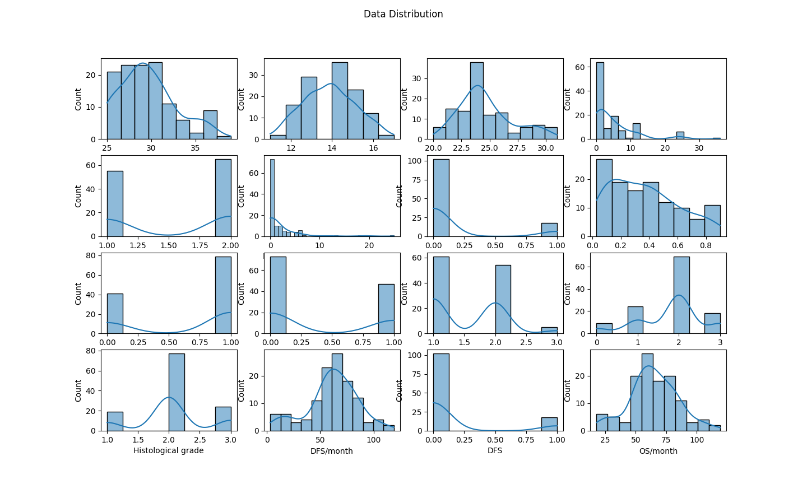
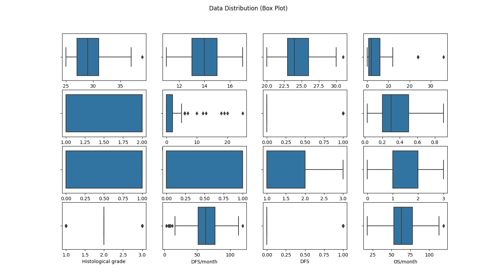
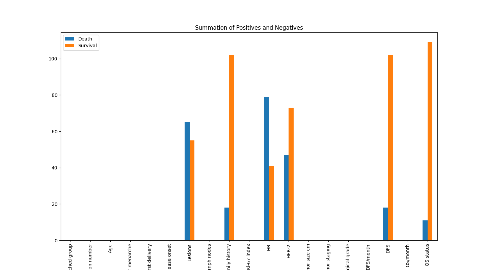
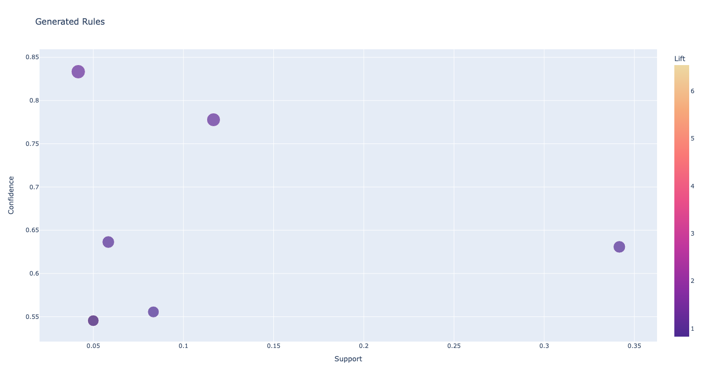

## Pregnancy-Associated Breast Cancer Patterns

In this project, association rules mining is used to identify patterns in the clinical characteristics and prognosis of pregnancy-associated breast cancer (PABC) patients and non-PABC subjects in [Hebei Breast Disease Treatment Center](https://dataverse.harvard.edu/dataset.xhtml?persistentId=doi:10.7910/DVN/SR06ED).

#### Data Distribution

#### Data Distribution (Box Plot)

#### Summation of Positives and Negatives in Dataset

#### Generated Association Rules

